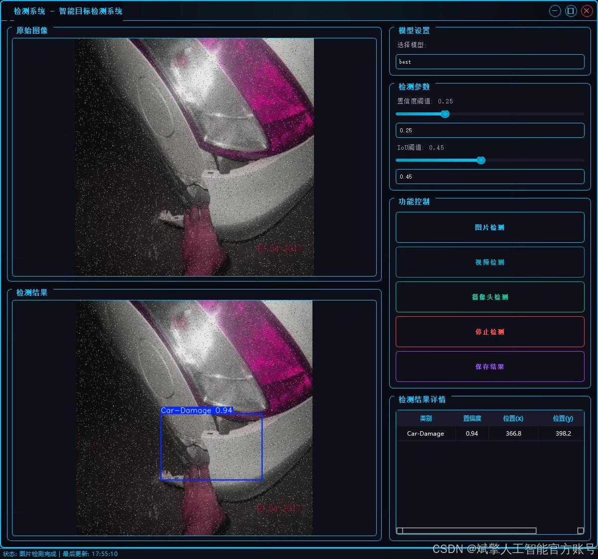
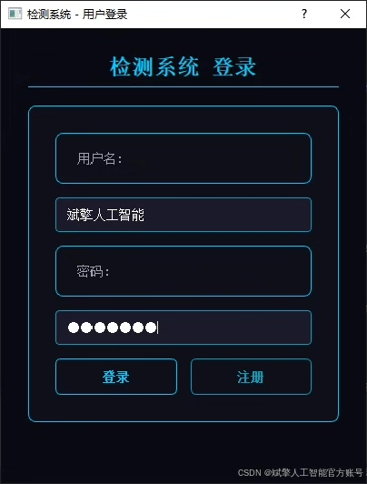
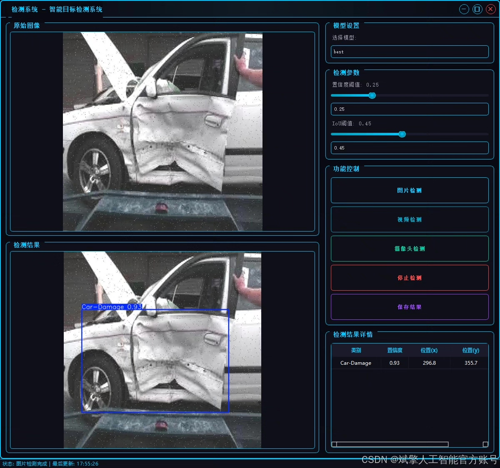
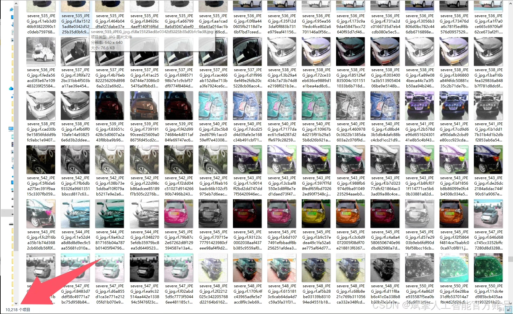
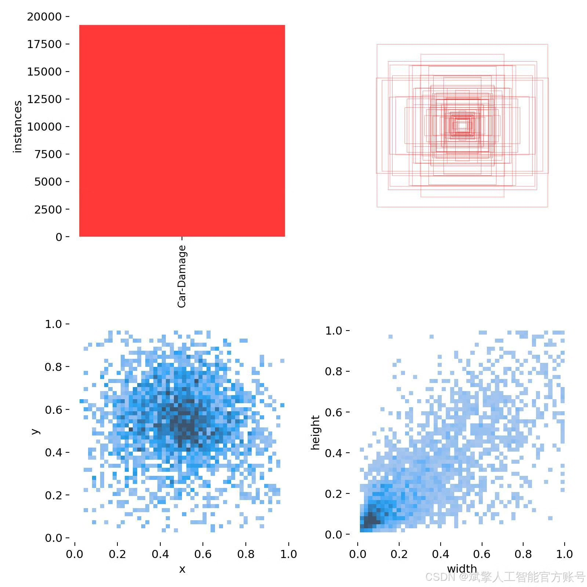
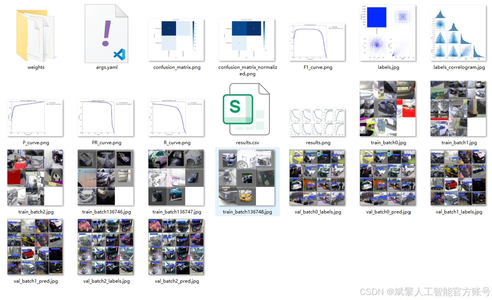
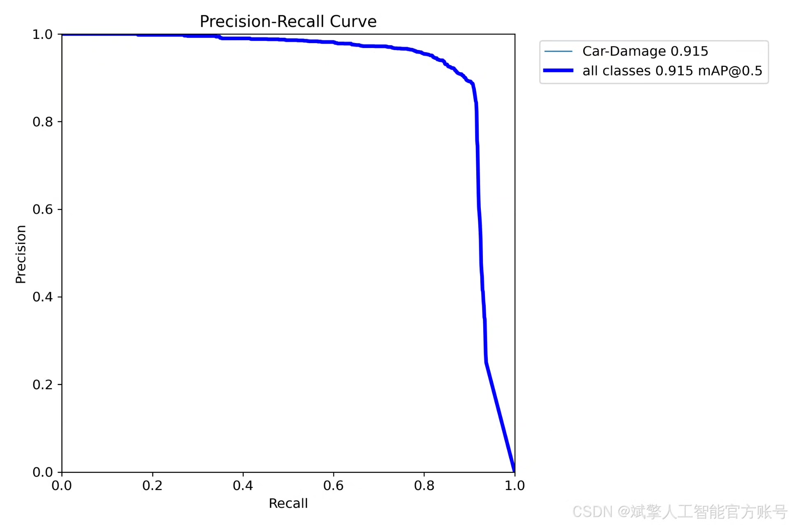
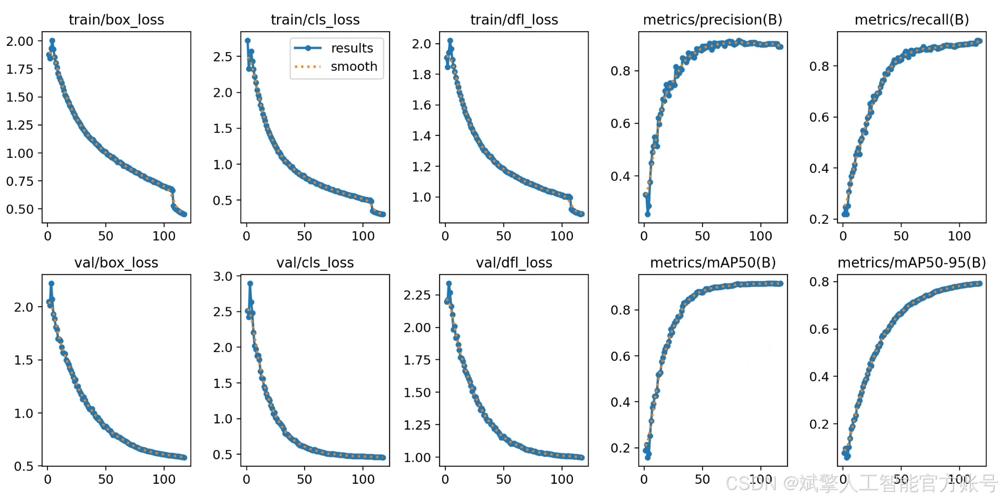
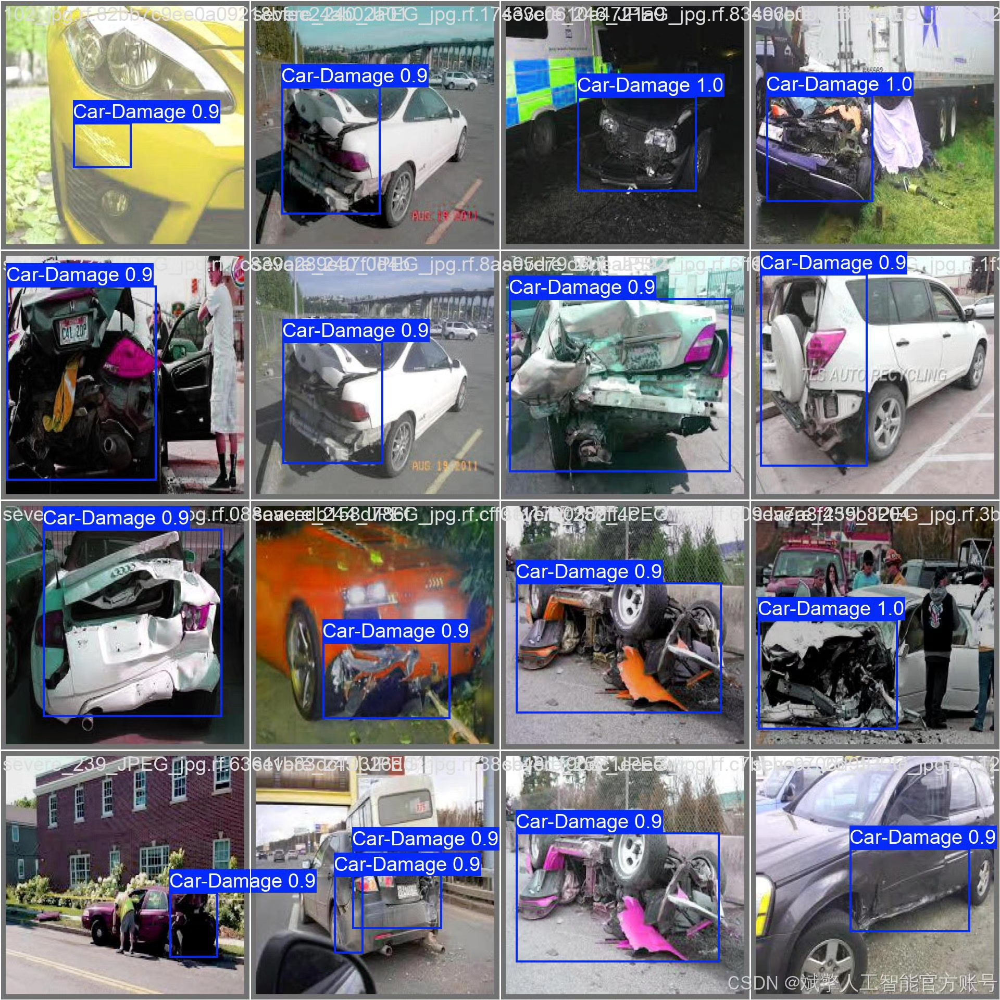

# YOLOv11 Automobile Damage Identification System

## Body

The YOLOv11 Automobile Damage Identification System is a high-performance intelligent identification and detection system for automobile damage based on the cutting-edge YOLOv11 object detection architecture. The core goal of this system is to accurately identify and locate vehicle damage areas in images or videos, focusing on the single category of "Car-Damage" for deep optimization. It can effectively meet the detection needs in various complex environments. By integrating deep learning and computer vision technologies, this solution aims to provide efficient, reliable, and practical intelligent technical tools for real applications such as fast damage assessment in auto insurance, automated inspection at accident sites, and used car valuation. This significantly enhances the efficiency and accuracy of related industries.

To achieve this goal, we have built and adopted a large-scale, highly labeled professional dataset as the foundation for system development. This dataset has been rigorously collected and standardized through a strict collection and labeling process, covering various typical models, different damage types (such as scratches, dents, cracks), and diverse lighting and background conditions, with a total of 11,675 images. All samples are precisely marked by professionals using bounding boxes to indicate the damaged areas. The dataset is scientifically divided into three parts: 10,218 images are used as the training set to drive the model to deeply learn the subtle features of damage; 971 images are used as the validation set during training to monitor the model's performance, adjust hyperparameters, and prevent overfitting in a timely manner; finally, 486 images remain as an independent test set, fully simulating real application scenarios to evaluate the final generalization ability and practicality of the trained model objectively, ensuring the robustness and reliability of the system in actual deployment.

✅ User login registration: Supports password verification and security validation.
✅ Three detection modes: Based on the YOLOv11 model, support image, video, and real-time camera detection, accurately identifying targets.
✅ Dual-screen comparison: Display original images and detection results simultaneously on the screen.
✅ Data visualization: Real-time table displaying the category, confidence, and coordinates of detected targets.
✅ Intelligent parameter adjustment: Offers a confidence slide bar to dynamically optimize detection accuracy, adapting to different scene requirements.
✅ Sci-fi style interactive interface: Dark theme combined with dynamic light effects, reducing visual fatigue and enhancing operational experience.

## Images

## Payment

Here is a pay link on Stripe ( https://buy.stripe.com/3cs8yP7sY87d0vu9AB ). Please contact me lonlonago@foxmail.com after funding $89, and I will send you a complete data files , thank you!

